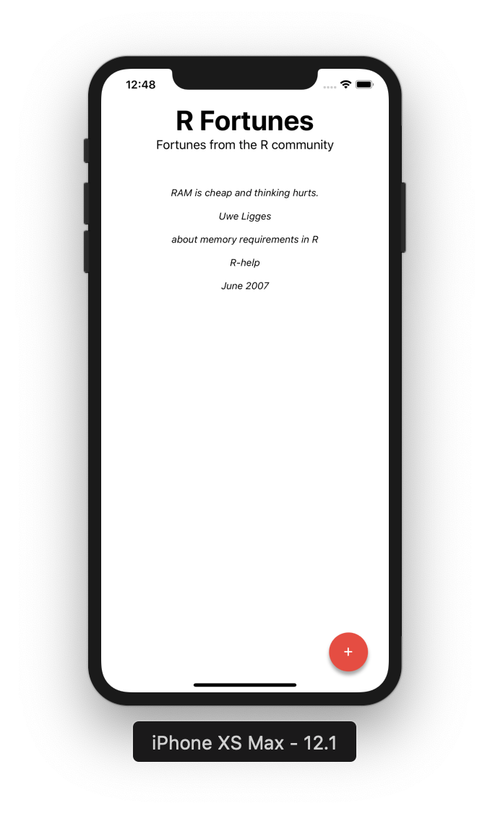

# RFortunes

A simple iOS app written with the [react-native](https://facebook.github.io/react-native/) javascript framework. RFortunes queries a random row from a SQLite database. The data comes from the [`fortunes`](https://cran.r-project.org/web/packages/fortunes/index.html) R package.
